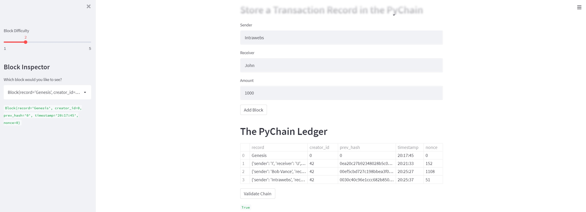

# PyChain Ledger

Hello, this repository is an example for training/educational purposes of using python to create a skeleton of a blockchain with hashing and verification using hashlib. Streamlit is used to display apps in the front end. App can demostrate the usage and the increasingly difficulty cryptographic math functions used to secure blockchains, along with a demostration of how blockchains record transactions in blocks. 

Code in starter file folder, will need to launch from Git using streamlit to see dashboard

Thank you

